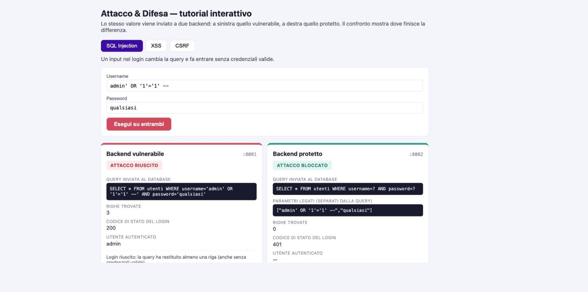
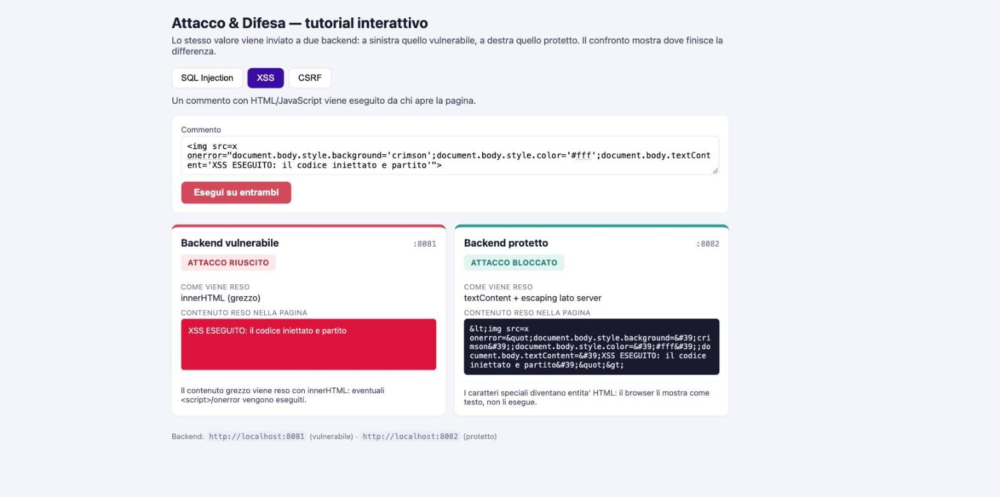
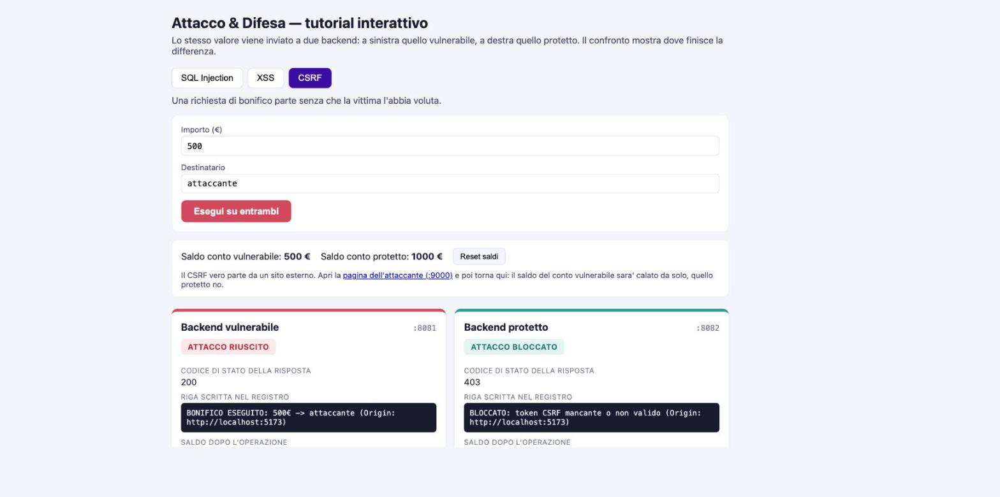
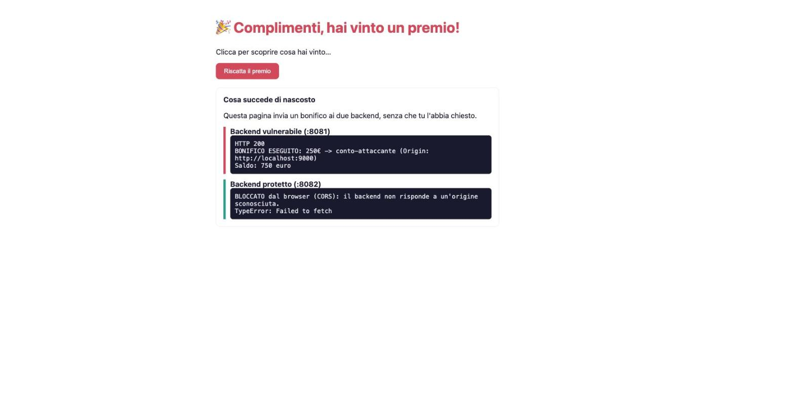

# Documentazione — Attacco & Difesa

Per ogni attacco: una schermata della demo, il valore usato come esempio, il confronto fra
il codice **vulnerabile** e quello **protetto** commentato in poche righe, e — la parte che
pesa di più — **il limite** della difesa: cosa non copre.

Architettura: due backend Spring Boot con gli **stessi endpoint** (porte 8081 vulnerabile e
8082 protetto) e un frontend React che invia lo stesso valore a entrambi e mostra le due
risposte affiancate.

---

## 1. SQL Injection

**Cos'è.** Il login costruisce una query SQL incollando dentro la stringa i valori digitati
dall'utente. Un input scritto ad arte non viene più letto come *dato* ma come *pezzo di
query*, e ne cambia la logica.

**Valore di esempio.** username = `admin' OR '1'='1' --` , password = `qualsiasi`



A sinistra la query diventa `... WHERE username='admin' OR '1'='1' --' AND password='...'`:
la condizione `'1'='1'` è sempre vera e `--` commenta il resto, quindi tornano **3 righe** e
il login passa come `admin`. A destra la stessa richiesta restituisce **0 righe** e **401**.

### Codice a confronto

```java
// VULNERABILE — i valori entrano nella stringa SQL per concatenazione
String query = "SELECT * FROM utenti WHERE username='" + body.username()
        + "' AND password='" + body.password() + "'";
List<Map<String,Object>> righe = jdbc.queryForList(query); // Statement: esegue la stringa

// PROTETTO — query fissa con segnaposto ?, i valori viaggiano come parametri
String query = "SELECT * FROM utenti WHERE username=? AND password=?";
List<Map<String,Object>> righe = jdbc.queryForList(query, body.username(), body.password());
```

**Cosa cambia.** Con i `?` la query è decisa a priori: i valori sono legati come parametri
dal driver (`PreparedStatement`) e non possono più diventare SQL. L'apice in `admin' OR ...`
viene cercato alla lettera in un username, non trovato, login rifiutato.

**Perché basta.** Il testo dell'utente non tocca mai la struttura della query: qualunque
apice, `OR`, `--` o `UNION` resta dato inerte.

**Limite / cosa non copre.** Protegge dalla *injection*, non dal resto: le password qui sono
in chiaro (nella realtà vanno cifrate con bcrypt), e le query parametrizzate non sostituiscono
controllo degli accessi, rate limiting sui tentativi e validazione dell'input. Attenzione
anche allo SQL dinamico che concatena **nomi di tabella/colonna** (i `?` valgono solo per i
valori): lì serve una whitelist.

---

## 2. XSS (Cross-Site Scripting)

**Cos'è.** Un commento contenente HTML/JavaScript viene salvato e poi reso nella pagina così
com'è. Chi apre la pagina esegue il codice dell'attaccante nel proprio browser.

**Valore di esempio.**
``



A sinistra il contenuto viene inserito con `innerHTML`: l'immagine fallisce, parte `onerror`
e il codice gira (riquadro cremisi "XSS ESEGUITO"). A destra il server ha trasformato i
caratteri speciali in entità HTML, quindi il browser mostra `&lt;img ...&gt;` come **testo**.

> Nota tecnica: nella demo il lato vulnerabile viene reso dentro un `<iframe sandbox>` isolato,
> così l'attacco si vede partire davvero senza toccare l'app del tutorial.

### Codice a confronto

```java
// VULNERABILE — il testo torna al client grezzo, senza alcuna trasformazione
return new XssResponse(true, testo, testo, "innerHTML (grezzo)", ...);

// PROTETTO — escaping lato server: i caratteri che aprono tag/attributi diventano entità
private String escapeHtml(String s) {
    return s.replace("&","&amp;").replace("<","&lt;").replace(">","&gt;")
            .replace("\"","&quot;").replace("'","&#39;");
}
```

Lato frontend, l'app usa sempre `textContent`/JSX (che fa escaping automatico) e **mai**
`innerHTML` con dati dinamici.

**Cosa cambia.** `<` e `>` diventano `&lt;` e `&gt;`: senza `<` non si apre nessun tag, quindi
``/`<script>` restano stringhe visibili invece che elementi eseguiti.

**Perché basta (in questo contesto).** Il payload finisce come testo dentro il corpo della
pagina, e il testo non viene eseguito.

**Limite / cosa non copre.** L'escaping giusto dipende dal **contesto** in cui il dato viene
inserito: dentro un attributo, in un URL (`href`/`src`), dentro un blocco `<script>` o in CSS
servono regole diverse; l'escaping HTML da solo non basta lì. La difesa vera è a più livelli:
output encoding contestuale + una **Content-Security-Policy** che blocchi gli script inline.
Inoltre non copre i sink DOM lato client (`element.innerHTML = ...`), che restano a carico del
frontend.

---

## 3. CSRF (Cross-Site Request Forgery)

**Cos'è.** Una pagina di un altro sito fa partire dal browser della vittima una richiesta
"legittima" (un bonifico) verso un backend, sfruttando il fatto che il backend non verifica
*chi* ha davvero avviato la richiesta.

**Valore di esempio.** importo = `500` , destinatario = `attaccante`



A sinistra il bonifico viene eseguito (**200**, riga di log `BONIFICO ESEGUITO`, saldo calato).
A destra viene rifiutato (**403**, log `BLOCCATO: token CSRF mancante o non valido`).

La demo reale è la **pagina dell'attaccante** su `:9000`: al solo caricamento invia il bonifico
ai due backend.



Il backend vulnerabile lo esegue (250€, saldo 750); il protetto è **bloccato dal browser (CORS)**
perché l'origine `:9000` non è consentita.

### Codice a confronto

```java
// VULNERABILE — nessun controllo: esegue per chiunque invii la richiesta
int nuovoSaldo = saldo.addAndGet(-importo);
return new CsrfResponse(true, 200, "BONIFICO ESEGUITO ...", nuovoSaldo, ...);

// PROTETTO — richiede un token anti-CSRF valido (rilasciato da /token) e l'origine giusta
if (csrfToken == null || !tokenValidi.contains(csrfToken))
    return ResponseEntity.status(403).body(... "token CSRF mancante o non valido" ...);
if (origin != null && !origin.equals(frontendOrigin))
    return ResponseEntity.status(403).body(... "origine non consentita" ...);
```

A questo si aggiunge il **CORS ristretto** del backend protetto (`allowedOrigins(:5173)`): una
pagina di un'altra origine viene fermata dal browser prima ancora di arrivare al controller.

**Cosa cambia.** Il token anti-CSRF è un segreto che solo il frontend legittimo riceve; una
pagina esterna non può conoscerlo, quindi la sua richiesta non passa. Il controllo dell'`Origin`
e il CORS ristretto sono una seconda barriera.

**Perché basta.** L'attaccante può indurre il browser a *inviare* la richiesta, ma non a
*includere il token*: senza token la richiesta viene respinta.

**Limite / cosa non copre.** Il token va gestito bene: se il frontend è a sua volta vulnerabile
a XSS, l'attaccante può leggere il token e il CSRF torna possibile (per questo XSS e CSRF vanno
chiusi insieme). Il controllo di `Origin`/`Referer` non è sempre presente e non sostituisce il
token. In produzione la difesa standard si completa con **cookie `SameSite`** e cookie di
sessione `HttpOnly`/`Secure`, aspetti che qui sono semplificati (il saldo è tenuto in memoria e
non c'è una vera sessione con login).

---

## In sintesi

| Attacco | Difesa applicata | Dettaglio che mostra la differenza | Il limite |
|---|---|---|---|
| SQL Injection | Query parametrizzate (`?`) | La query inviata al DB | Non copre hashing password, autorizzazione, identificatori dinamici |
| XSS | Escaping lato server + `textContent` | Il contenuto reso nella pagina | Serve encoding per contesto + CSP; restano i sink DOM |
| CSRF | Token anti-CSRF + Origin/CORS ristretto | Codice di stato + riga di log | Se c'è XSS il token è leggibile; servono anche cookie `SameSite` |

Il messaggio di fondo: **nessuna difesa è totale**. Ognuna chiude un punto preciso, e va
combinata con le altre e con le buone pratiche che stanno intorno (sessioni, cifratura,
validazione, CSP).
